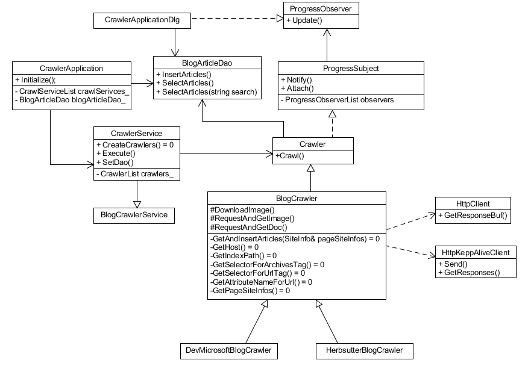

# Crawler Project REAEME

   

## CrawlerApplication

Main class of crawler

## CrawlerApplicationDlg

Main class of view dialog

## Crawler

Base Cralwer Class

## BlogCrawler

Blog Base class

## DevMicrosoftBlogCrawler

Crawler for `https://herbsutter.com/`

## HerbsutterBlogCrawler

Crawler for `https://devblogs.microsoft.com/oldnewthing/`

## BlogArticleDao

Sqlite Data Access Object

## ProgressSubject

Notify crawling progress observer

## ProgressObserver

Updated by crawling progress subject

## HttpClient

http client for request (images..)

## HttpKeepAliveClient

http client for keep alive request (articles..)
